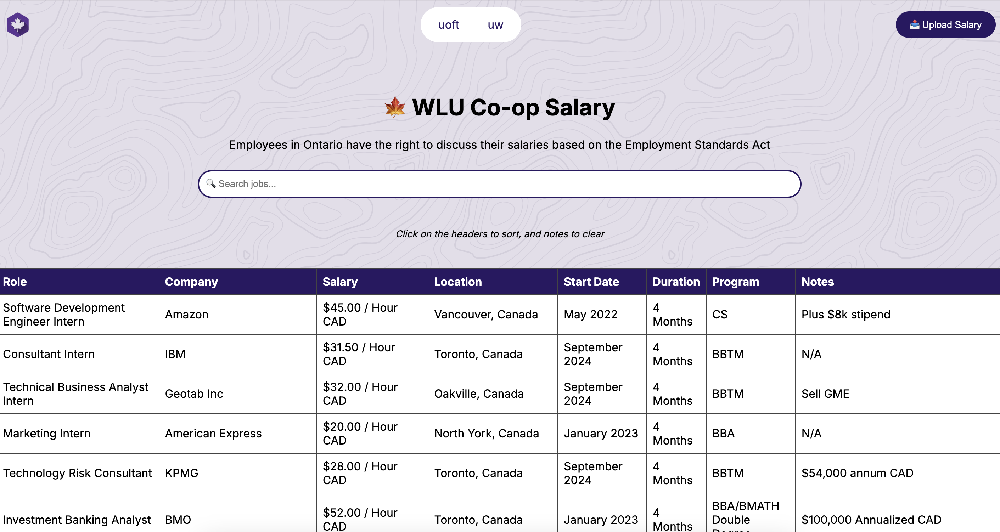

# Coop Salary Database
Salary transparency is important! I made a public Google Sheet that gained traction, and the logical next step was a queryable database.
*inspired by uoft and uwaterloo's salary sheets*

# Technologies
- Back-end: Next.js
- Front-end: Raw HTML, CSS and JS
- Database: Supabase (i think...)
- Form: Google Form -> Google Sheets -> API to Supabase
- Host: Vercel
